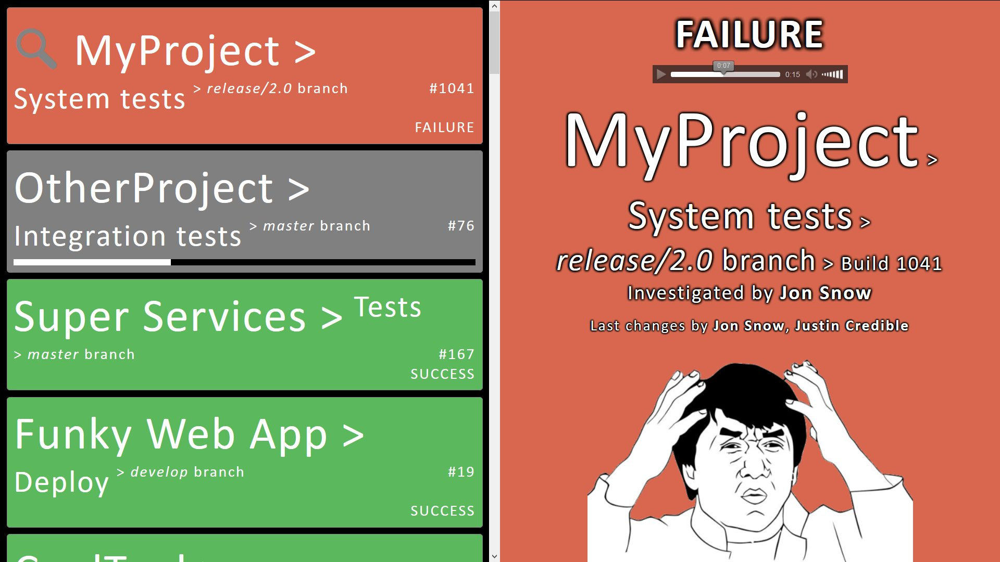

TravCorp's Radiator for TeamCity
==========
Based on [RobBollons/tc-radiate](https://github.com/RobBollons/tc-radiate) with improved features:
* Self hosted on 'github.io' - deploy automatically by pushing to gh-pages branch
* Supports 'no guest account' setups of TeamCity (uses standard browser's basic authentication, so no credentials saved when not wanted)
* Support for multiple projects (displays full name of each build)
* Prioritize by _Uninvestigated Failure_ > _Investigated Failure_ > _Running_ > _Success_ (big picture always shows highest priority)
* Show author names of failed changes (triggerer displayed when no changes)
* Show investigator and investigator's comment
* Sound on failure (can be muted persistently)
* Very easy to add more sounds and images. Supports remote URLs with fallback to local ones.

Working monitors
-------------
They're here: https://travcorp.github.io/tc-radiate/
(use your own TeamCity credentials or the [shared one](http://ttcwiki/display/itropics/Passwords+to+production#Passwordstoproduction-teamcitysharedaccount))

Hacking the monitors:
-------------
Clone this repo, play with the code and make a pull request to the `gh-pages` branch. The above page will update automatically!

#### Adding/Changing content
Edit the lists files for [images](https://github.com/travcorp/tc-radiate/blob/gh-pages/Content/images/!List.js) or [sounds](https://github.com/travcorp/tc-radiate/blob/gh-pages/Content/sounds/!List.js). The lists work with local files (dropped to the same folder as the list) as well as remote URLs (make sure that they work - hosts sometimes reject cross-domain requests).

#### Testing local changes
To test your changes on your local machine, you need to open the index.html file in a browser with disabled cross-domain security. In the [main folder](https://github.com/travcorp/tc-radiate) there are open-in-*-for-local-development.cmd files, which help you to do this. Please read and follow instructions displayed during execution.

**_Original readme from tc-radiate follows:_**

-------------

tc-radiate
==========
A simple JavaScript build radiator for TeamCity

Please feel free to fork and hack away at the code.

Configuration
-------------
1. To configure tc-radiate with your own TeamCity server go to 'Settings.js' and edit the relevant variables.
2. Set your TeamCity to allow cross-domain requests from the domain where you host the monitor (see [TeamCity Doc](https://confluence.jetbrains.com/display/TCD9/REST+API#RESTAPI-CORSSupport)). Alternatively, use a [Proxy](#proxy).

Proxy
-----
This is not advised if you can set up CORS in TeamCity (see [Configuration](#configuration)), but in the absence of other choice you can use a proxy web application to request the TeamCity web services. In the 'proxies' folder there is an example of a an ASP.NET proxy which needs to be ran on IIS. If you want to use this, just copy it into the root tc-radiate folder and hook the folder up to an IIS website.
